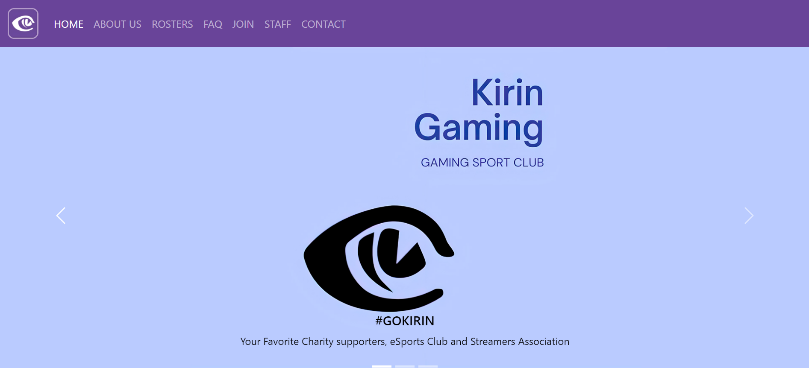
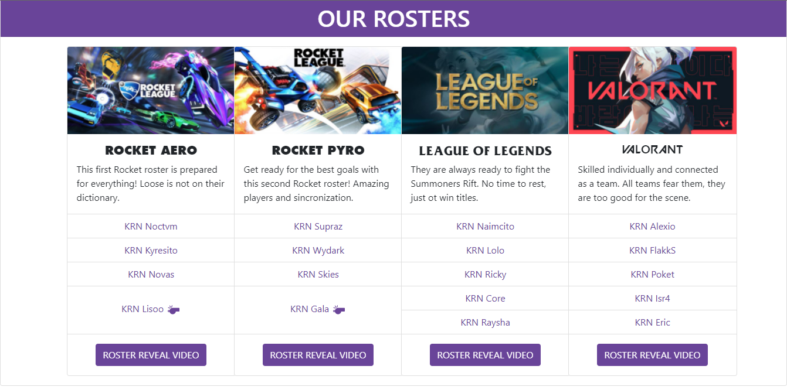
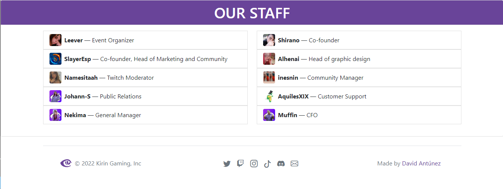

# Kirin Gaming Esports Club Website
This is an Open Source project about a website for the professional organization [**Kirin Gaming**](https://twitter.com/KirinGamingClub) .
Also, this is a project made for MarkDown Language subject in [@IESCampanillas](https://github.com/IESCampanillas).

It is made mainly in Bootstrap framework with additional CSS code and custom HTML.
The aim of this proyect is both contribute to the organization development (for free) and to hand over the MarkDown Language project.
The original code is 100% made by me: [David Antúnez Pérez](https://github.com/DavidAntunezPerez) .
All the images and content are taken from the organization Kirin Gaming with their permission and also from their social media.

## - PROJECT PREVIEW (SCREENSHOTS):

